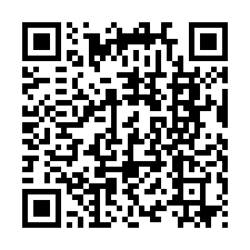
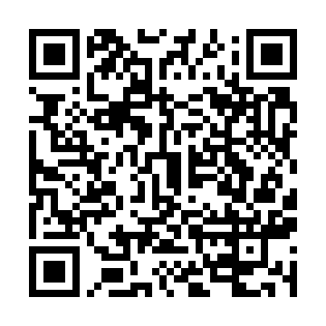

<h1 align="center">Hoshizora (ほしぞら)</h1>

Nintendo 3DS 用の星座観察アプリ / Constellation viewer for Nintendo 3DS

3DS を空にかざすと、その方向の星空・星座・太陽・月・惑星を表示します。 
Point your 3DS at the sky to see the stars, constellations, Sun, Moon and planets in that direction.

## 主な機能 / Features

- 約 9100 個の恒星、88 星座の線と解説 / About 9,100 stars, lines and descriptions for all 88 constellations
- 太陽・月・惑星の表示 / Sun, Moon and planets
- 上下2画面表示と、星座の解説表示の切り替え / Two-screen view or constellation description view
- 星座の立体視 / Stereoscopic 3D constellations
- 夜間モード（目が暗さに慣れたままでいられる赤い表示） / Night mode (red display that keeps your eyes dark-adapted)
- 観測地を地図から選択（時差・夏時間は自動計算） / Choose your site on a map (time zone and daylight saving time are handled automatically)
- 録画（AVI、最長 30 秒） / Video recording (AVI, up to 30 s)
- 日本語 / English

## 必要なもの / Requirements

- カスタムファームウェア（Luma3DS など）を導入した Nintendo 3DS / A Nintendo 3DS with custom firmware (e.g. Luma3DS)
- Old 3DS 向けに作っています。New 3DS では動作未確認です。 / Made for the Old 3DS; not tested on the New 3DS.

## インストール / Install

| Universal-Updater | FBI |
|:---:|:---:|
|  |  |
| 設定 →「UniStore を選ぶ」→「QR コードで追加」 Settings → Select UniStore → Add with QR code | Remote Install → Scan QR Code |

- Homebrew Launcher で使う場合は [Releases](https://github.com/namaenashi0310/Hoshizora/releases/latest) から `star.3dsx` をダウンロードして、SD カードの `/3ds/` に置いてください。 
  For the Homebrew Launcher, download `star.3dsx` from [Releases](https://github.com/namaenashi0310/Hoshizora/releases/latest) and copy it to `/3ds/` on your SD card.
- Universal-Updater にキーボードで追加する場合の URL / URL for adding with the keyboard: 
  `https://github.com/namaenashi0310/Hoshizora/releases/latest/download/hoshizora.unistore`

## 初めて起動したとき / First start

1. 言語を選びます。 / Choose your language.
2. 地図で観測地を選びます。 / Choose your observing site on the map.
3. 太陽・月・北極星のどれかを画面中央の十字に合わせて A を押します（白い線と緑の線を重ねると正確です）。 
   Center the Sun, the Moon or Polaris in the crosshair and press A (overlap the white and green lines for best results).

この位置合わせで方角を決めます。ずれてきたら A で何度でもやり直せます。 
This step sets the direction. If the view drifts, press A to align again.

## 操作 / Controls

| ボタン / Button | 動作 / Action |
|:---|:---|
| A | 位置合わせ／決定 / Align / OK |
| B | キャンセル / Cancel |
| X | 表示の切り替え（上下2画面 ⇔ 上画面＋解説） / Switch view (two screens ⇔ top screen + description) |
| Y | 星座線のオン/オフ / Constellation lines on/off |
| スライドパッド上下 / Circle Pad up/down | 拡大・縮小 / Zoom |
| L | 録画の開始／停止（止めたあと A で AVI に書き出し） / Start/stop recording (press A afterwards to export an AVI) |
| SELECT | 設定 / Settings |
| START | 終了 / Exit |
| 3D ボリューム / 3D slider | 星座が立体に見えます / Constellations appear in 3D |

## 注意 / Notes

- 本体の時計は観測地の現地時間に合わせてください（時差・夏時間は自動計算）。ずれると星の位置もずれます。 
  Set the system clock to the local time of your site (time zone and daylight saving time are handled automatically). A wrong clock shifts the stars.
- 録画は SD:/3ds/star/ に保存され、1 秒あたり約 17MB 使います。 
  Videos are saved to SD:/3ds/star/ and use about 17 MB per second.

## クレジット / Credits

使用データ（Yale 輝星表、ヒッパルコス星表、d3-celestial、Natural Earth）とライブラリの出典・ライセンスは、THIRD_PARTY_NOTICES.txt とアプリの「設定 → クレジット」にあります。 
Sources and licenses of the data (Yale Bright Star Catalogue, Hipparcos, d3-celestial, Natural Earth) and libraries are in THIRD_PARTY_NOTICES.txt and under Settings → Credits in the app.

## ライセンス / License

(c) 2026 makotamu. All rights reserved.

- 任天堂とは関係のない非公式の自作ソフトです。使用は自己責任でお願いします。 / Unofficial homebrew, not affiliated with Nintendo. Use at your own risk.
- 無断での転載・再配布はご遠慮ください。 / Please do not redistribute or re-upload without permission.
